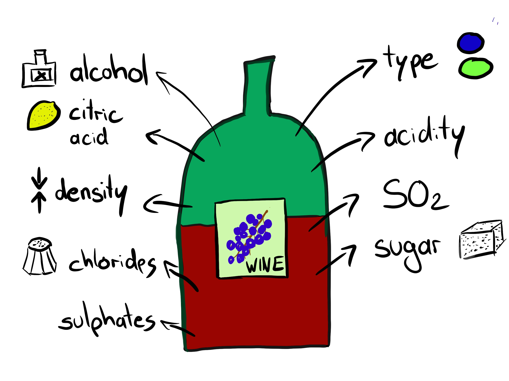
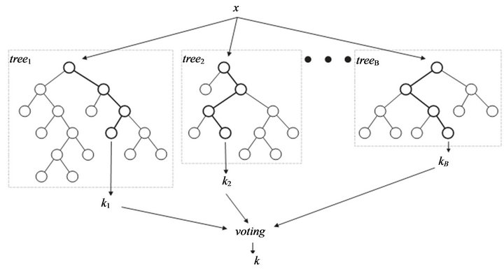
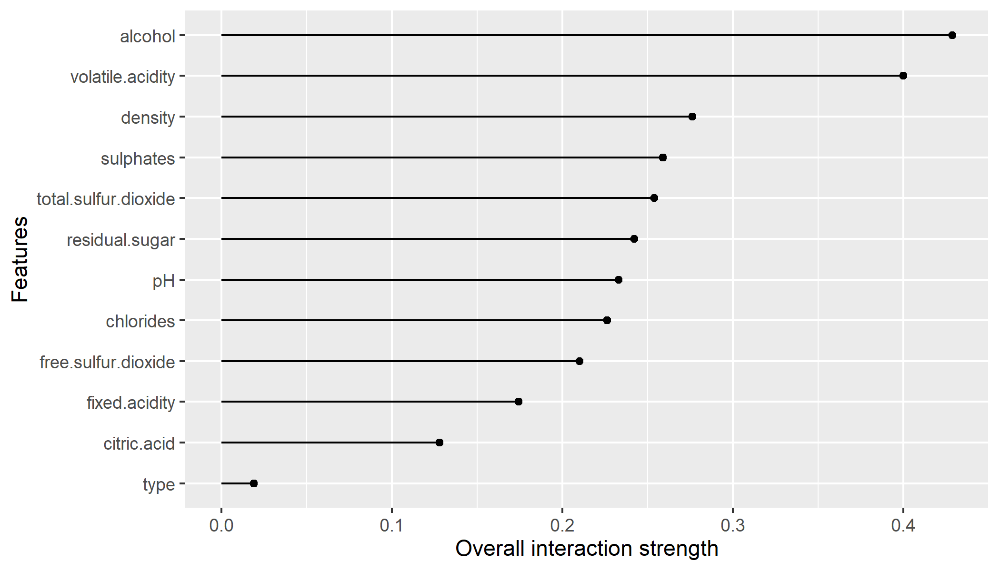
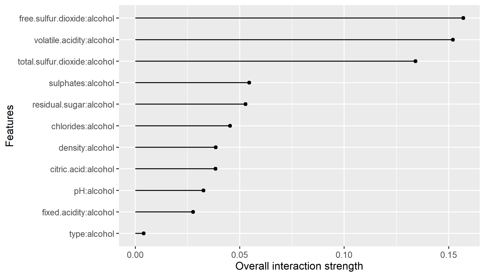
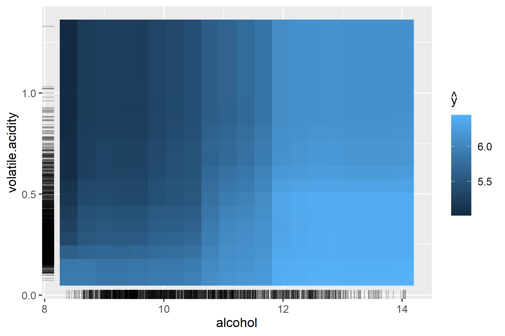

```{r setup, echo=FALSE}
set.seed(123)
longrun = FALSE
knitr::opts_chunk$set(cache = TRUE,
  warning = FALSE,
  message = FALSE,
  echo = TRUE,
  R.options = list(width = 120))

colorize <- function(x, color) {
  # see https://bookdown.org/yihui/rmarkdown-cookbook/font-color.html
  if (knitr::is_latex_output()) {
    sprintf("\\textcolor{%s}{%s}", color, x)
  } else if (knitr::is_html_output()) {
    sprintf("<span style='color: %s;'>%s</span>", color,
      x)
  } else x
}

show.solution = T
```

# Introduction

### Load the iml package

Before we start, we need to load some libraries:

* `ranger` is a package that supplies the random forest algorithm for classification and regression. We use it to train a model for our data. 
* `iml` is a package that implements several model-agnostic interpretation methods that explain the the model behavior and its predictions.
* `ggplot`, `grid.Extra`, and `DataExplorer` will be used for plotting and a quick exploratory data analysis.

```{r library}
library('ranger')
library('iml')
library('ggplot2')
library('gridExtra')
library('DataExplorer')
```

### Wine Data

```{r, out.width = "50%", echo=FALSE}

```

We can import the wine data set from the 'data' folder and apply some pre-processing steps.

```{r data}
wine_complete = read.csv(file.path("../data", "wine.csv"))
# Removing 36 wines with missing values
wine_complete = na.omit(wine_complete)
# convert wine type from data type character to type factor (create levels/categories for modelling purposes)
wine_complete$type = as.factor(wine_complete$type)
```

The data set:

* 6500 red and white Portuguese "Vinho Verde" wines (the ratio between white and red is approximately 3:1)
* Features: Physicochemical properties
* Quality assessed by blind tasting, from 0 (very bad) to 10 (excellent)

```{r exploredta}
plot_bar(wine_complete)
plot_histogram(wine_complete)
```

### Model

Finally, we apply machine learning to predict the quality of wine using the random forest algorithm.

```{r, echo= FALSE}

```

Some interpretation methods make more sense if they are applied on test data (i.e., data that was not used to fit a model). 
Hence, we split up the data into a training set on which the random forest is trained and a test set which we will use to analyze our model using several interpretation methods.

We store the trained model in an object `rfmod` and use 1000 observations for the test set and IML analysis.

```{r model}
# sample 1000 observations randomly as test set and use all other observations for training the model
set.seed(1)
test_ind = sample(1:nrow(wine_complete), size = 1000, replace = FALSE)
train_ind = setdiff(1:nrow(wine_complete), test_ind)
wine_train = wine_complete[train_ind,]
wine = wine_complete[test_ind,]

# fit the random forest to be analyzed 
rfmod = ranger(quality ~ ., data = wine_train)
```

# Exercises

You can copy and paste the previously shown code to import the data and model.
Note that for all following exercises, we will use the test data `wine` that contains 1000 observations.


### Exercise 0: The Predictor 

Create a `Predictor` object using the `iml` package.

```{r, eval = FALSE, echo = FALSE, results='asis'}
cat("<!--")
```

<details>
  <summary>**Solution**</summary>
A Predictor object holds a machine learning model (mlr3, caret, randomForest, ...) and the data to be used for analyzing the model.
The interpretation methods in the `iml` package require that the machine learning model and the data are wrapped in a Predictor object.

```{r predictor}
rfpred = Predictor$new(rfmod, data = wine, y = "quality")
```

</details>

```{r, eval = FALSE, echo = FALSE, results='asis'}
cat("-->")
```

### Exercise 1 (a): PD and ALE plots
Create PDP and ALE plots for at least 6 features of your dataset you are most interested in how they affect your target variable. Can you see any differences between PDP and ALE plots? Can you explain those differences?


```{r, eval = !show.solution, echo = FALSE, results='asis'}
cat("<!--")
```


<details>
  <summary>**Solution**</summary>
  
The `FeatureEffects` class implements accumulated local effect (ALE) plots (which is the default `method`), partial dependence plots (which needs to be specified via `method="pdp"`) and individual conditional expectation curves (which need to be specified via `method="pdp+ice"`).

The marks (rug plot) on the x-axis indicate the distribution of the feature values, showing how relevant a region is for interpretation (little or no points mean that predictions might be uncertain in this area and hence we cannot reliably interpret these regions).

```{r pd_effects}
pd_effects = FeatureEffects$new(rfpred, method = "pdp", grid.size = 10)
pd_effects$plot()
```

We compare it to the ALE plots of all features:
```{r ale_effects}
ale_effects = FeatureEffects$new(rfpred, method = "ale", grid.size = 10)
ale_effects$plot()
```

</details>
```{r, eval = !show.solution, echo = FALSE, results='asis'}
cat("-->")
```


### Exercise 1.2: PDP and ICE

TODO

Plot the PDP and ICE curves of the feature alcohol. What do you observe?

`r colorize("hint", "blue")`: `FeatureEffect$new` with `method="pdp+ice"`

```{r, eval = !show.solution, echo = FALSE, results='asis'}
cat("<!--")
```

<details>
  <summary>**Solution**</summary>
Individual conditional expectation (ICE) plots visualize how the model prediction of individual observations for one feature changes by varying its feature values while keeping all other features' values fixed.

```{r pdpice}
alc_pdp_ice = FeatureEffects$new(rfpred, method = "pdp+ice")
alc_plot_ice = alc_pdp_ice$plot()
alc_plot_ice
```

</details>
```{r, eval = !show.solution, echo = FALSE, results='asis'}
cat("-->")
```

### Exercise 1.3: Interactions

Compute the interaction strength of all features using the H-statistic to identify the feature that contains the strongest interactions with other features.

`r colorize("hint", "blue")`: Use `Interaction$new`.

```{r, eval = !show.solution, echo = FALSE, results='asis'}
cat("<!--")
```


<details>
  <summary>**Solution**</summary>
We can also measure if interactions between features are present and rank them according to their interaction strength. An interaction between two features is present if the individual average marginal effects of the two features do not add up to their joint effect. Therefore, the interaction measure H-Statistics calculates how much of the variance of the joint distribution is explained by the interaction term. The measure is between 0 (no interaction) and 1 (= the variance of the joint distribution is completely defined by interactions). For each feature, we measure how much they interact with any other feature:

```{r ia, eval=longrun}
intera = Interaction$new(rfpred)
intera$plot()
```
```{r saveia, echo=FALSE, eval=longrun}
ggsave("../images/intera.png", plot = intera$plot(), width = 7, height = 4)
```
```{r loadia, echo=FALSE, eval=!longrun, out.height="80%"}

```

Since alcohol seems to interact most with other features, we dig deeper to understand which features have the highest interaction with alcohol.

</details>
```{r, eval = !show.solution, echo = FALSE, results='asis'}
cat("-->")
```


### Exercise 1.4: 2-way Interactions with Feature 'alcohol'

In the previous exercise, we only identified the feature with strongest interactions.
But it does not tell us with which other features the strongest interacting feature interacts.
Now, you are asked to compute the interaction statistic between alcohol (the feature of interest) and all other features.

`r colorize("hint", "blue")`: Use again `Interaction$new` but now you need to additionally specify the feature of interest (here alcohol). Checkout the help page via `?Interaction` to find out how to do this.

```{r, eval = !show.solution, echo = FALSE, results='asis'}
cat("<!--")
```


<details>
  <summary>**Solution**</summary>
Besides general interactions, we can also specify a feature and measure all its 2-way interactions with all other features:


```{r ice, echo = FALSE, eval = FALSE}
alc_ice = FeatureEffect$new(rfpred, feature = "alcohol", method = "ice")
ice_dta = alc_ice$plot()
wine20 = as.data.frame(sapply(colnames(wine)[-12], function(x) rep(wine[,x], each = 20)))
colnames(wine20) = colnames(wine)[-12] 
```

```{r ia_alc, eval=longrun}
intera_alc = Interaction$new(rfpred, feature = "alcohol")
intera_alc$plot()
```
```{r saveia_alc, echo=FALSE, eval=longrun}
ggsave("../images/intera_alc.png", plot = intera_alc$plot(), width = 7, height = 4)
```
```{r loadia_alc, echo=FALSE, eval=!longrun}

```

</details>
```{r, eval = !show.solution, echo = FALSE, results='asis'}
cat("-->")
```


### Exercise 1.5: 2D-PDP

Compute a 2D-PDP between alcohol and one of the most important features that interacts with alcohol (from the previous exercise).

`r colorize("hint", "blue")`: In previous exercises, we used `FeatureEffect$new` to create 1-dimensional PDPs. But now you are asked to create a 2-dimensional PDP for alcohol and  one of the most important features that interacts with alcohol from the previous exercise. Look up the help page `?FeatureEffect` to find out how to do this.

```{r, eval = !show.solution, echo = FALSE, results='asis'}
cat("<!--")
```


<details>
  <summary>**Solution**</summary>

Here we choose `volatile.acidity` but `free.sulfur.dioxide` would also be an option according to the H-statistic.

```{r, alc_acidity_pdp, eval=longrun}
alc_pdp = FeatureEffect$new(rfpred, feature = c("alcohol", "volatile.acidity"), method = "pdp", grid.size = 10)
alc_pdp$plot()
```
```{r save2D, echo=FALSE, eval=longrun}
ggsave("../images/2D.png", plot = alc_pdp$plot(), width = 6, height = 4)
```
```{r load2D, echo=FALSE, eval=!longrun}

```

The 2D-PDP visualizes the interaction between alcohol and acidity. The higher the alcohol volume and the less acid a wine is the higher is its quality. However, it needs to be noted that there are just a few observations for very high values of acidity and hence predictions in this region need to be regarded with caution.

</details>
```{r, eval = !show.solution, echo = FALSE, results='asis'}
cat("-->")
```


### Exercise 2 (a): Permutation Feature Importance

Make yourself familiar with the `FeatureImp` method in the **iml** package and calculate the permutation feature importance (PFI) for all features in your dataset. Calculate the PFI on your training and on your test dataset.
Do you observe any differences? Interpret your results.

```{r, eval = !show.solution, echo = FALSE, results='asis'}
cat("<!--")
```


<details>
  <summary>**Solution**</summary>
We can measure the loss-based importance for each feature with `FeatureImp`. The resulting importance scores are calculated by shuffling each feature individually and measuring how much the performance drops (or in this case how much the 'mae' (loss) increases) compared to the original model's performance. For this regression task, we choose to measure the loss with the mean absolute error ('mae'), another choice would be the mean squared error ('mse').

Once we create a new object of `FeatureImp`, the importance is automatically computed.
We can call the `plot()` function of the object ...

```{r fimportance}
f_imp = FeatureImp$new(rfpred, loss = "mae")
plot(f_imp)
```

... or look at the results in a data.frame.

```{r fimportance_result}
results = f_imp$results
rmarkdown::paged_table(results) # this line produces a nice table output in the html
```

In this example, `r results[1,"feature"]` and `r results[2,"feature"]` seem to have the highest contribution to the prediction of wine quality among all features. 

The scores refer to the ratio between the mae values after permuting the considered feature vs. without permuting the considered feature (see the description of the `compare` argument in `?FeatureImp`). The higher these values, the more important a feature.

</details>
```{r, eval = !show.solution, echo = FALSE, results='asis'}
cat("-->")
```

### Exercise 2 (b): LOCO

Write a function which calculates the LOCO feauture importance on the test dataset. How does it differ to the PFI results? Explain your observation.
Hint: Refit your model on the training data without the feature of interest. Predict with the refitted model on the test dataset and calculate the loss difference between your original model and your refitted model.
Repeat for all features.

```{r, eval = !show.solution, echo = FALSE, results='asis'}
cat("<!--")
```


<details>
  <summary>**Solution**</summary>

We first predict on the full model and calculate the loss:

```{r loco1}
rf_full = ranger(quality ~ ., data = wine_train)
pred_full = predict(rf_full, wine)$predictions
loss_full = mean(abs(wine$quality - pred_full))
```

Now, we create a function that takes the feature number, refits the learner without the selected feature, calculates the loss and returns the loss difference. We apply the function to all features and save the results in a data.frame:
```{r loco2}
loco = function(feature) {
  rf_reduced = ranger(quality ~ ., data = wine_train[, -feature])
  pred_reduced = predict(rf_reduced, wine[, -feature])$predictions
  loss_reduced = mean(abs(wine$quality - pred_reduced))
  loss_reduced - loss_full
}
feats = 1:(ncol(wine)-1)
loco_res = data.frame(Feature = colnames(wine)[feats], 
                         LOCO = sapply(feats, loco))
```

We can look at the results ...

```{r loco3}
loco_res
```

... or plot them, e.g. in a bar plot:

```{r loco4}
# To sort
loco_res$Feature = factor(loco_res$Feature, 
                          levels = loco_res$Feature[order(loco_res$LOCO)])

# Plot
ggplot(loco_res, aes(x = Feature, y = LOCO)) + 
  geom_bar(stat = "identity") + 
  coord_flip()

```

We see a similar picture as with PFI, i.e. high importance of alcohol and volatile acidity, but very different values. There are two reasons for the different values: 

* The `FeatureImp` function by default calculates a ratio of the losses, we just calculated a difference. 
* Results of conditional feature importance (here: LOCO) are generally smaller than those of marginal measures (here: PFI). 

</details>
```{r, eval = !show.solution, echo = FALSE, results='asis'}
cat("-->")
```

### Exercise 2 (c): Comparison with feature effects

Compare your feature importance values to your feature effect results of the first exercise sheet. Are they conclusive?

```{r, eval = !show.solution, echo = FALSE, results='asis'}
cat("<!--")
```


<details>
  <summary>**Solution**</summary>

Yes, they are generally conclusive in this example. In feature effects, we see more details such as effect directions. On the other hand, feature importance clearly shows the most important features. 

</details>
```{r, eval = !show.solution, echo = FALSE, results='asis'}
cat("-->")
```

### Exercise 3 (a): LIME

Choose 2-3 observations from your dataset which you would like to explain. How do the different features influence the predictions of the regarded observations? Use LIME for your analysis and interpret your results.
Hint: Use `LocalModel` from the **iml** package.

```{r, eval = !show.solution, echo = FALSE, results='asis'}
cat("<!--")
```


<details>
  <summary>**Solution**</summary>

We choose a white wine of very good quality (8) and a red wine of mediocre quality (5): 

```{r lime1}
idx1 = which(wine$quality == 8 & wine$type == "white")[11]
idx2 = which(wine$quality == 5 & wine$type == "red")[1]
```

We now use `LocalModel` to compute LIME for both wines (with all features):

```{r lime2}
lime1 = LocalModel$new(rfpred, x.interest = wine[idx1,], k = 10)
lime2 = LocalModel$new(rfpred, x.interest = wine[idx2,], k = 10)
```

And plot both results side by side:

```{r lime3, fig.width=10, fig.height=5}
grid.arrange(plot(lime1), plot(lime2), nrow = 1)
```

We see that the results look quite similar between the good and the mediocre wine. We also see a problem of LIME: While the actual prediction of the random forest is quite accurate, the local model fit is very bad for the good wine. With that, we should interpret the results with care.

</details>
```{r, eval = !show.solution, echo = FALSE, results='asis'}
cat("-->")
```

### Exercise 3 (b): Counterfactual Explanations

Your task is to choose an observation in your dataset of which you want to change the label (e.g. credit accepted vs. credit declined in a classification task or change a wine with a rating of 5 to a predicted wine rating of 6 in a regression task). Try to find such a counterfactual by changing as few features as possible (e.g., 1-2 features) and with rather small changes.

Bonus: Try the **counterfactuals** package (https://github.com/dandls/counterfactuals), e.g. with the method `MOCRegr` or `MOCClassif`, and compare your results.


```{r, eval = !show.solution, echo = FALSE, results='asis'}
cat("<!--")
```

<details>
  <summary>**Solution**</summary>
We know that, generally speaking, volatile acidity has a rather negative effect on the predicted quality while alcohol has a rather positive effect.
Therefore, we'll search for a wine with low alcohol (<9.5) but high volatile acidity (>0.5) and then, artificially, turn those values up, respectively down, until the rating for the regarded observation reaches a value of 6.

First, find such a wine and look at it: 

```{r incr_wineq1}
idx = which(wine$quality == 5 & wine$alcohol < 9.5 & wine$volatile.acidity > 0.5)
wine1 = wine[idx[1], ]
wine1
```

Now, we create a grid with a sequence and turn up alcohol volume slowly to 12 and volatile acidity down to 0.2:

```{r incr_wineq2}
alc_steps = seq(wine1$alcohol, 13, length.out = 30)
va_steps = seq(wine1$volatile.acidity, 0.2, length.out = 30)
grid_wine = expand.grid(alcohol = alc_steps, volatile.acidity = va_steps)
head(grid_wine)
```

With this, we create a new dataframe - keep all features constant (values of the regarded wine) and only vary alcohol and acidity (by using the created grid):

```{r incr_wineq3}
cols = setdiff(colnames(wine1), colnames(grid_wine))
cols # these are the columns of features that are kept oonstant
wine_experiment = cbind(wine1[, cols], grid_wine)
head(wine_experiment)
```

Finally, we predict with the random forest model to see how the predictions for the regarded wine changes when we only vary the alcohol and acidity features while keeping all other features constant.

```{r incr_wineq4}
rfmod_pred = predict(rfmod, wine_experiment)
wine_experiment$rfmod_prediction = rfmod_pred$predictions
rmarkdown::paged_table(wine_experiment[wine_experiment$rfmod_prediction > 6, ])
```

For the considered wine, we reach the prediction of wine quality > 6 at around 12%-13% alcohol and volatile acidity of around 0.3. 

```{r last_plot}
p1 = ggplot(wine_experiment, aes(alcohol, volatile.acidity)) +
  geom_raster(aes(fill = rfmod_prediction)) +
  scale_fill_viridis_c()

p2 = ggplot(wine_experiment, aes(alcohol, volatile.acidity)) +
  geom_point(aes(col = factor(rfmod_prediction > 6)))

library(patchwork)
p1 / p2
```

For the bonus solution, we take the same wine as above but use multi-objective counterfactual explanations from the **counterfactuals** package:

```{r cebonus}
library(counterfactuals)
moc = MOCRegr$new(rfpred, n_generations = 15L, quiet = TRUE)
ces = moc$find_counterfactuals(x_interest = wine1, desired_outcome = 7)
head(ces$data)
```
First, the algorithm suggests to have a white wine instead of the red one. The other solutions tend to mostly increase alcohol, as we manually did above. 

</details>
```{r, eval = !show.solution, echo = FALSE, results='asis'}
cat("-->")
```

### Exercise 4 (a): Shapely Values - local analysis
Choose 3-4 observations of your dataset which might be worth to explain via Shapley values. Explain how you chose these observations.

```{r, eval = !show.solution, echo = FALSE, results='asis'}
cat("<!--")
```


<details>
  <summary>**Solution**</summary>

TODO

</details>
```{r, eval = !show.solution, echo = FALSE, results='asis'}
cat("-->")
```

### Exercise 4 (b): Shapely Values - local analysis

Calculate and visualize the Shapley values for these observations and interpret your results.

```{r, eval = !show.solution, echo = FALSE, results='asis'}
cat("<!--")
```


<details>
  <summary>**Solution**</summary>
We choose a high quality wine (8) with rather low alcohol volume (<10).

```{r shapley}
idx = which(wine$quality >= 8 & wine$alcohol < 10)[1]
shapley_values = Shapley$new(rfpred, x.interest = wine[idx,])
plot(shapley_values)
```

The plot shows how much the actual prediction of the wine deviates from the average wine quality and how this deviation is attributed to the different features. In this specific example, we can see that the low acidity and pH value contribute most to the good rating of the wine. 


</details>
```{r, eval = !show.solution, echo = FALSE, results='asis'}
cat("-->")
```

### Exercise 4 (c): Shapely Values - global analysis

Sample 100 observations from your dataset at hand and calculate the Shapley values for these observations

* Calculate the Shapley feature importance for your sample. How does it differ from the PFI?
* Create a Shapley dependency plot for the 6 features you have chosen in the feature effects exercise and compare your plots with the PDPs.

```{r, eval = !show.solution, echo = FALSE, results='asis'}
cat("<!--")
```


<details>
  <summary>**Solution**</summary>
```{r shapley_global, eval=FALSE}
set.seed(1)
idx = sample(1:nrow(wine), size = 100, replace = FALSE)
shapley_values_all = lapply(idx, function(i){
  shapley_values = Shapley$new(rfpred, x.interest = wine[i,])
  cbind(shapley_values$results[,1:3], "feature.value" = as.numeric(shapley_values$x.interest))
})
shapley_values_all = do.call("rbind", shapley_values_all)
save(shapley_values_all, file = "wine_example/data/shapley.RData")

```
Based on this sample we can approximate the global behavior of features, e.g., by plotting the Shapley dependency for individual features


```{r shapley_shap_dep}
load("../data/shapley.RData")
ggplot(data = shapley_values_all[which(shapley_values_all$feature == "alcohol"),]) + geom_point(aes(x=feature.value, y = phi)) + theme_bw()


```

</details>
```{r, eval = !show.solution, echo = FALSE, results='asis'}
cat("-->")
```


